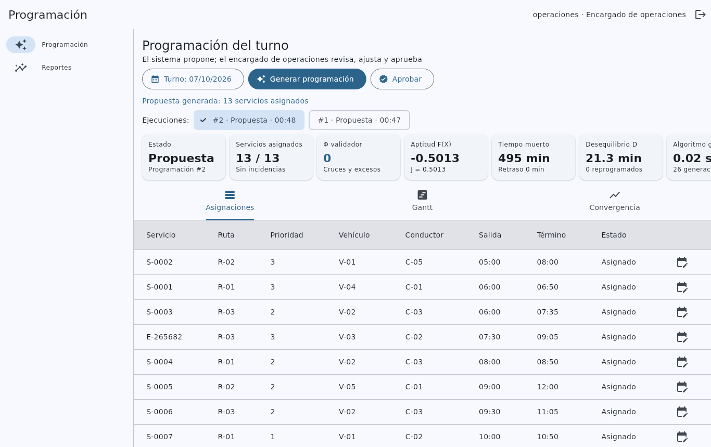

# Sistema de asignación de recursos — Transportes y Turismo San Felipe S.A.C.

Sistema web y de escritorio que **propone la programación diaria** de la
empresa (Soritor, San Martín): asigna a cada servicio del turno un vehículo,
un conductor y una salida autorizada con un **algoritmo genético**, sin cruces
de vehículos ni de conductores y respetando licencias, turnos y límites de
conducción. El encargado de operaciones revisa la propuesta, la ajusta si
hace falta y la aprueba; el personal de despacho registra los recursos, los
servicios y las incidencias, y el sistema calcula los indicadores de
desempeño (PIO, PSR, PSA, PUV y PAV).

Implementa el modelo del capítulo III de la tesis *Sistema de asignación de
recursos basado en algoritmo genético para optimizar la programación
operativa* (ecuaciones 1–15 y 19–23, Tabla 22, historias HU-01 a HU-11).

| | |
|---|---|
| Versión | **1.0.0** (contrato de la API `1.0.0`) |
| Arquitectura | cliente **Flutter (MVC)** · servidor **Dart** (Controller–Service–Repository) · **MySQL 8.4** |
| Instalación | `docker compose up --build` |
| Pruebas | 118 automatizadas, incluida una de ciclo completo interfaz → servidor → MySQL → interfaz |



---

## Tecnologías (versiones fijas)

| Componente | Tecnología |
|---|---|
| Cliente | Flutter 3.47.6 (web, Windows, Linux) · `provider 6.1.5+1` · `http 1.6.0` |
| Servidor | Dart 3.13.5 · `shelf 1.4.2` · `shelf_router 1.1.4` · `dart_jsonwebtoken 3.4.1` · `crypto 3.0.7` · `yaml 3.1.4` |
| Base de datos | MySQL 8.4.11 · `mysql_client_plus 0.1.3` (TLS) |
| Núcleo compartido | paquete `dominio` (Dart puro): contrato, modelos, algoritmo genético, voraz, validador |
| Despliegue | Docker Compose · imagen del servidor AOT sobre `scratch` · nginx 1.28 para el cliente web |
| Pruebas | `package:test 1.32.0` · `flutter_test` · `integration_test` |

Las dependencias transitivas quedan fijadas en los `pubspec.lock` versionados.

## Arquitectura

```text
 Cliente Flutter (MVC)                       Servidor Dart                          MySQL 8.4
┌───────────────────────────┐   REST/JSON   ┌──────────────────────────────────┐   SQL/TLS   ┌──────────┐
│ Vistas → Controladores →  │ ────────────▶ │ Router → Controladores →         │ ──────────▶ │ esquema  │
│ Modelo (ApiCliente,       │   JWT, cookie │ Servicios → Repositorios         │             │ del      │
│ repositorios remotos)     │ ◀──────────── │      └→ núcleo de optimización   │ ◀────────── │ modelo   │
└───────────────────────────┘ X-Version-Api └──────────────────────────────────┘             └──────────┘
             └──────────── paquetes/dominio: contrato y modelos compartidos ──────────┘
```

Detalle en [docs/arquitectura.md](docs/arquitectura.md) y diagramas UML en
[docs/uml.md](docs/uml.md).

## Instalación y ejecución (un solo comando)

Requisitos: **Docker** con **Compose v2** (Docker Desktop en Windows o macOS)
y unos 4 GB libres para construir las imágenes.

```sh
git clone https://github.com/Madafaka17/sistema-asignacion-san-felipe.git
cd sistema-asignacion-san-felipe
cp .env.example .env
#   Edite .env: DB_PASSWORD, MYSQL_ROOT_PASSWORD y JWT_SECRETO
#   (genere este último con:  openssl rand -base64 48)
docker compose up --build
```

La primera construcción tarda unos minutos (descarga Flutter y compila).
Después:

| Qué | Dónde |
|---|---|
| Cliente web | <http://localhost:3000> |
| API | <http://localhost:8080/api/version> |
| MySQL (MySQL Workbench) | `127.0.0.1:3306`, usuario y contraseña de `.env` |

Usuarios de demostración (datos ficticios de `basedatos/datos_ejemplo.sql`;
cámbielos antes de usar el sistema con datos reales):

| Usuario | Contraseña | Rol | Ve |
|---|---|---|---|
| `jdespacho` | `Despacho2026` | Personal de despacho | servicios, vehículos, conductores, rutas, incidencias |
| `operaciones` | `Opera2026` | Encargado de operaciones | programación y reportes |
| `admin` | `Admin2026` | Administrador | usuarios, parámetros y bitácora |

Recorrido sugerido: ingrese como `operaciones`, pulse **Generar
programación** (turno de mañana, 12 servicios cargados), revise la tabla, el
Gantt y la curva de convergencia y pulse **Aprobar**.

```sh
docker compose down        # detiene (conserva los datos)
docker compose down -v     # borra también la base (se recarga al volver a subir)
```

> **Detrás de un proxy corporativo** que inspecciona TLS: copie el
> certificado de su CA como `docker/certificados/ca.crt` y use
> `docker compose -f docker-compose.yml -f docker-compose.proxy.yml up --build`.

### Uso desde otros equipos de la red

Los puertos se publican solo en `127.0.0.1`. Para la red de la empresa,
cambie `127.0.0.1` por la IP del servidor en `docker-compose.yml`, ponga un
proxy HTTPS delante de nginx y mantenga `COOKIE_SEGURA=true` (con HTTP sin
TLS en la red local, póngalo en `false`).

## Desarrollo sin Docker

Requisitos: Dart 3.13.5, Flutter 3.47.6 y un MySQL 8.4 con
`basedatos/esquema.sql` (y opcionalmente `datos_ejemplo.sql`) cargados.

```sh
# Servidor (lee DB_*, JWT_SECRETO… del entorno; ver .env.example)
cd servidor && dart pub get
set -a && source ../.env && set +a
DB_HOST=127.0.0.1 PARAMETROS_ARCHIVO=../config/parametros.yaml dart run bin/servidor.dart

# Cliente de escritorio (Linux o Windows)
cd cliente && flutter pub get
flutter run -d linux --dart-define=API_URL=http://localhost:8080/api
flutter build windows --release --dart-define=API_URL=http://SERVIDOR:8080/api

# Cliente web en modo desarrollo (el servidor debe admitir el origen en CORS_ORIGENES)
flutter run -d chrome --web-port 3000 --dart-define=API_URL=http://localhost:8080/api
```

Los parámetros del método (población, generaciones, pesos de `J`, matriz de
licencias…) están en [`config/parametros.yaml`](config/parametros.yaml); con
Docker basta `docker compose restart servidor` para aplicarlos.

## Pruebas

```sh
(cd paquetes/dominio && dart test)    # 53: núcleo, ecuaciones, contrato
(cd servidor && dart test)            # 49: HU-01…HU-11 sobre MySQL (base <DB_NAME>_pruebas)
(cd cliente && flutter test)          # 14: ApiCliente, controladores, formulario HU-06
herramientas/e2e.sh                   # 2: ciclo completo y recorrido de pantallas (escritorio)
```

Las del servidor y las de integración usan el MySQL de `docker compose`
(variables `PRUEBAS_DB_*`/`DB_*` del `.env`). Detalle de cada nivel y de la
prueba de ciclo completo en [docs/pruebas.md](docs/pruebas.md).

## Estructura del repositorio

```text
paquetes/dominio/      paquete compartido: contrato, modelos y núcleo de optimización
servidor/              API REST: bin/servidor.dart, lib/src/{http,controladores,servicios,repositorios,seguridad}
cliente/               Flutter MVC: lib/{modelo,controladores,vistas}, test/, integration_test/
basedatos/             esquema.sql, datos_ejemplo.sql, creación de la base de pruebas
config/parametros.yaml parámetros del modelo y del algoritmo (RNF-07)
docker/, */Dockerfile  imágenes y configuración de nginx
herramientas/          e2e.sh (pruebas de integración), respaldo.sh (respaldo y restauración)
docs/                  documentación técnica, UML, wireframes y capturas
```

## Documentación

| Documento | Contenido |
|---|---|
| [arquitectura.md](docs/arquitectura.md) | capas, comunicación, despliegue, configuración y seguridad |
| [uml.md](docs/uml.md) | casos de uso, componentes, clases, secuencias, actividad, despliegue y ER (versión final) |
| [metodos_modelos_algoritmos.md](docs/metodos_modelos_algoritmos.md) | lógica principal, algoritmos, validaciones e indicadores |
| [formalizacion_algoritmo.md](docs/formalizacion_algoritmo.md) | ecuación → pseudocódigo → código, isomorfismo, estructura de datos y complejidad |
| [teoria_algoritmo_genetico.md](docs/teoria_algoritmo_genetico.md) | diseño del algoritmo genético y parámetros (Tablas 22 y 23) |
| [modelo_datos.md](docs/modelo_datos.md) | tablas de MySQL y su correspondencia con el modelo |
| [contrato_api.md](docs/contrato_api.md) | endpoints, autenticación, errores y versionado |
| [wireframes.md](docs/wireframes.md) | wireframes por caso de uso y su implementación |
| [pruebas.md](docs/pruebas.md) | estrategia y resultados de las pruebas |
| [decisiones_y_desviaciones.md](docs/decisiones_y_desviaciones.md) | diferencias con el diseño de la tesis y pendientes |

## Versiones

Las etiquetas siguen MAYOR.MENOR.PARCHE y la versión del contrato de la API
(`X-Version-Api`); cliente y servidor operan juntos si coinciden en
MAYOR.MENOR.

| Etiqueta | Contenido |
|---|---|
| `v0.1.0` | paquete `dominio`: modelo matemático, algoritmo genético y voraz, contrato |
| `v0.2.0` | base de datos y servidor REST con pruebas de aceptación |
| `v0.3.0` | cliente Flutter MVC y prueba de ciclo completo |
| `v1.0.0` | entorno Docker, documentación final y UML según lo construido |

## Respaldos (RNF-05)

```sh
herramientas/respaldo.sh                              # respaldos/sanfelipe_AAAAMMDD_HHMMSS.sql.gz
herramientas/respaldo.sh restaurar respaldos/ARCHIVO.sql.gz
```

Prográmelo a diario con cron o con el Programador de tareas de Windows.

## Nota sobre el prototipo anterior

`src/`, `tests/`, `requirements.txt`, `pytest.ini`, `.python-version` y
`config/parametros_ga.yaml` son de un primer prototipo en Python que esta
versión reemplaza; ninguna parte del sistema actual los usa y pueden
eliminarse (ver [decisiones_y_desviaciones.md](docs/decisiones_y_desviaciones.md) §7).
