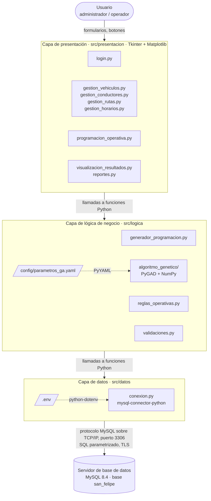
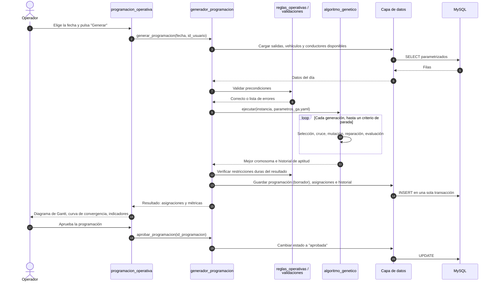
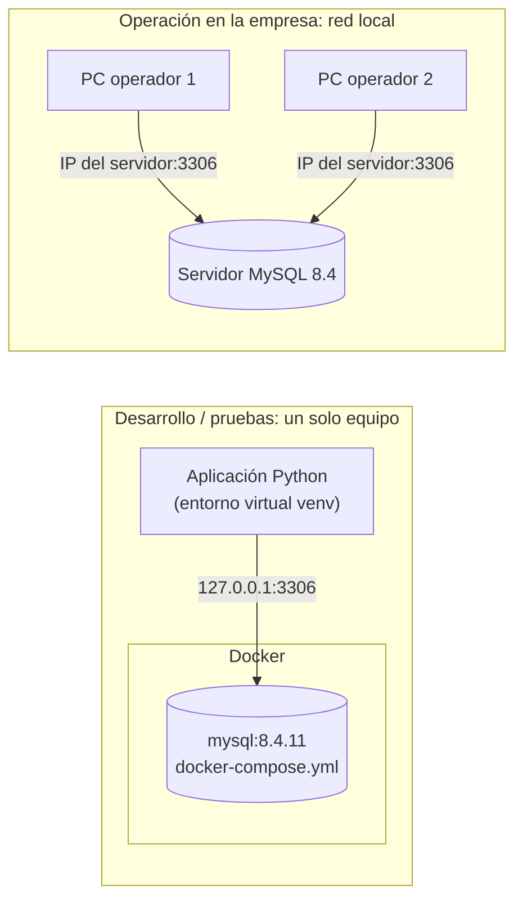

# Arquitectura del sistema

Este documento describe los componentes del sistema, cómo se organizan en
capas y cómo se comunican entre sí. La lógica interna de cada componente se
describe en [Métodos, modelos y algoritmos](metodos_modelos_algoritmos.md) y
en [Teoría del algoritmo genético](teoria_algoritmo_genetico.md).

## 1. Visión general

El sistema es una **aplicación de escritorio en Python** organizada en
**tres capas lógicas** (presentación, lógica de negocio y datos) que se
conecta a un **servidor de base de datos MySQL**. Físicamente hay dos
niveles:

| Nivel | Qué contiene | Dónde se ejecuta |
|---|---|---|
| **Cliente** | Las tres capas de la aplicación: interfaz gráfica, lógica de negocio (incluido el algoritmo genético) y acceso a datos | Equipo de cada operador o administrador |
| **Servidor de base de datos** | MySQL 8.4 con la base `san_felipe` | El mismo equipo (desarrollo, con Docker) o un servidor de la red local de la empresa |

Cada capa solo conoce a la capa inmediatamente inferior. La interfaz nunca
ejecuta SQL y el algoritmo genético no accede a la base de datos ni a la
interfaz: recibe los datos del día ya cargados y devuelve la mejor solución.
Por eso el algoritmo se puede probar de forma aislada con datos sintéticos.

## 2. Diagrama de componentes

Las tres capas se ejecutan dentro de la aplicación, en el equipo cliente; la
base de datos se ejecuta en el servidor. Los archivos con forma de
paralelogramo son archivos de configuración que lee el componente señalado.

## 3. Responsabilidades de cada componente

### Capa de presentación (`src/presentacion/`)

Interfaz gráfica con **Tkinter** (incluida en Python) y gráficos con
**Matplotlib** integrados en las ventanas. Solo muestra datos, recoge lo que
escribe el usuario y llama a funciones de la capa de lógica.

| Módulo | Responsabilidad |
|---|---|
| `login.py` | Inicio de sesión y control de acceso por rol |
| `gestion_vehiculos.py` | Alta, edición, baja y consulta de vehículos |
| `gestion_conductores.py` | Alta, edición, baja y consulta de conductores |
| `gestion_rutas.py` | Mantenimiento de rutas |
| `gestion_horarios.py` | Mantenimiento de horarios (salidas recurrentes por ruta) |
| `programacion_operativa.py` | Elegir la fecha, lanzar el algoritmo, revisar y aprobar la programación |
| `visualizacion_resultados.py` | Diagrama de Gantt por vehículo y por conductor, curva de convergencia del algoritmo |
| `reportes.py` | Reportes de programación, horas por conductor y uso de la flota; exportación a CSV |

### Capa de lógica de negocio (`src/logica/`)

| Módulo | Responsabilidad |
|---|---|
| `generador_programacion.py` | Coordina el caso de uso principal: carga los datos del día, arma la instancia del problema, ejecuta el algoritmo, valida y guarda el resultado |
| `reglas_operativas.py` | Define las reglas del negocio (solapamientos, licencias, jornada máxima, descansos) y las funciones que las verifican |
| `validaciones.py` | Valida los datos que ingresa el usuario (placa, DNI, fechas, capacidades) y las precondiciones antes de programar |
| `algoritmo_genetico/` | Algoritmo genético: `cromosoma`, `poblacion`, `aptitud`, `seleccion`, `cruce`, `mutacion`, `reparacion`, `elitismo`, `criterios_parada` y el orquestador `algoritmo.py`, que configura y ejecuta `pygad.GA` |

### Capa de datos (`src/datos/`)

| Archivo | Responsabilidad |
|---|---|
| `conexion.py` | Lee las credenciales de `.env`, abre conexiones a MySQL y controla las transacciones (`commit` o `rollback`) |
| `esquema.sql` | Definición de tablas, claves, restricciones y vistas |
| `datos_ejemplo.sql` | Datos ficticios para desarrollo y pruebas |

Las consultas de cada entidad (listar vehículos operativos, guardar una
programación, etc.) se agregan en esta capa y usan `obtener_conexion()`.

## 4. Comunicación entre componentes

| Origen → destino | Mecanismo | Qué se intercambia |
|---|---|---|
| Usuario → presentación | Eventos de la interfaz Tkinter | Datos de formularios, fecha a programar, aprobación |
| Presentación → lógica | Llamadas a funciones Python, en el mismo proceso | Parámetros simples (fecha, id de usuario) y objetos de resultado (asignaciones, métricas) |
| Lógica → algoritmo genético | Llamadas a funciones Python | Instancia del problema (salidas, vehículos, conductores, reglas) y parámetros; devuelve el mejor cromosoma y el historial de aptitud |
| Lógica → datos | Llamadas a funciones Python | Diccionarios u objetos con las filas leídas o a guardar |
| Datos → MySQL | Protocolo cliente/servidor de MySQL sobre TCP/IP (puerto 3306), cifrado con TLS cuando el servidor lo admite (MySQL 8.4 lo activa por defecto) | Sentencias SQL **parametrizadas** y sus resultados |
| `.env` → datos | `python-dotenv` carga el archivo al iniciar | Host, puerto, base de datos, usuario y contraseña |
| `parametros_ga.yaml` → algoritmo | `PyYAML` | Tamaño de población, probabilidades, pesos, criterios de parada, semilla |

### Flujo principal: generar la programación de un día

## 5. Despliegue

- **Desarrollo:** `docker compose up -d` levanta MySQL 8.4.11, crea la base y
  el usuario de la aplicación y carga `esquema.sql` y `datos_ejemplo.sql`. El
  puerto solo se publica en `127.0.0.1`, así que no es accesible desde otras
  máquinas.
- **Operación:** cada equipo ejecuta la aplicación con su propio `.env`, con
  `DB_HOST` apuntando al servidor. En el servidor, el usuario de la
  aplicación se crea para la red local (por ejemplo,
  `'san_felipe_app'@'192.168.1.%'`) en lugar de `127.0.0.1`, y el puerto 3306
  se abre solo a esa red. MySQL controla la concurrencia entre
  usuarios y la regla de *una sola programación aprobada por fecha* se
  garantiza con un índice único en la base de datos, no en la aplicación.

## 6. Configuración y secretos

| Archivo | ¿Se versiona? | Contenido |
|---|---|---|
| `.env.example` | Sí | Plantilla con los nombres de las variables y valores de ejemplo |
| `.env` | **No** (`.gitignore`) | Credenciales reales de cada equipo |
| `config/parametros_ga.yaml` | Sí | Parámetros del algoritmo y de las reglas operativas |
| `docker-compose.yml` | Sí | Versión exacta de MySQL y su configuración |

Las variables de entorno definidas en el sistema tienen prioridad sobre las
de `.env`. Cada programación guarda una copia de los parámetros usados
(`programacion.parametros`, tipo JSON), así que cualquier resultado se puede
volver a obtener aunque el archivo YAML cambie después.

## 7. Seguridad

- **Inyección SQL:** todas las consultas usan parámetros (`%s`) del conector,
  nunca concatenación de texto.
- **Contraseñas de usuarios:** se guarda un hash PBKDF2-SHA256 con sal
  (módulo estándar `hashlib`), nunca el texto plano.
- **Roles:** `administrador` (mantenimiento de datos maestros, usuarios y
  aprobación) y `operador` (generar y consultar programaciones).
- **Credenciales de la base de datos:** solo en `.env`; la aplicación usa un
  usuario propio (`san_felipe_app`) con permisos únicamente sobre la base
  `san_felipe`, nunca `root`.
- **Datos personales:** DNI y teléfonos de conductores solo existen en la base
  de datos; los respaldos y exportaciones (`respaldos/`, `salidas/`, `*.csv`)
  están excluidos del repositorio.

## 8. Decisiones de diseño

| Decisión | Alternativa descartada | Motivo |
|---|---|---|
| Aplicación de escritorio con Tkinter | Aplicación web | Pocos usuarios en la oficina de la empresa; no requiere servidor web y Tkinter viene incluido en Python |
| MySQL | SQLite | Varios usuarios simultáneos, integridad referencial y restricciones `CHECK` aplicadas por el motor |
| PyGAD | Algoritmo genético programado desde cero | Biblioteca probada que permite reemplazar los operadores de cruce y mutación por operadores propios del problema |
| Algoritmo genético independiente de la base de datos | Consultar la base durante la evaluación | La evaluación se ejecuta miles de veces: con los datos en memoria es rápida, determinista y fácil de probar |
| Guardar el resultado en una sola transacción | Guardar asignación por asignación | Si algo falla no queda una programación a medias |
| Versiones exactas de las dependencias y de MySQL | Rangos de versiones | Que otra persona obtenga exactamente el mismo comportamiento y los mismos resultados |
