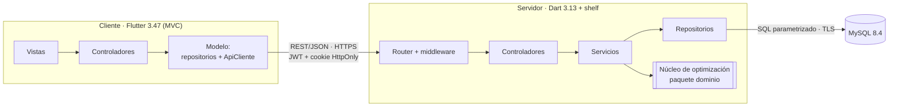

# Arquitectura del sistema

Sistema cliente–servidor de tres capas físicas: **cliente Flutter** (web y
escritorio), **servidor Dart** con una API REST y **MySQL 8.4**. El núcleo de
optimización y el contrato de la API viven en un paquete Dart compartido
(`paquetes/dominio`). Los diagramas UML completos están en [`uml.md`](uml.md).

## 1. Visión general



| Capa | Carpeta | Responsabilidad | No hace |
|---|---|---|---|
| Presentación (V) | `cliente/lib/vistas/` | dibujar el estado y enviar acciones al controlador | HTTP, reglas de negocio |
| Control (C) | `cliente/lib/controladores/` | estado de cada caso de uso (`ChangeNotifier`): cargando, errores por campo, lista, propuesta | HTTP (solo usa interfaces de repositorio), SQL |
| Modelo del cliente (M) | `cliente/lib/modelo/` | `ApiCliente` (JWT, renovación, versión, errores) y repositorios remotos | dibujar |
| HTTP del servidor | `servidor/lib/src/http/`, `controladores/` | rutas, autenticación, autorización por rol, JSON ⇄ objetos del contrato | reglas de negocio, SQL |
| Lógica de negocio | `servidor/lib/src/servicios/` | validaciones (HU-02 a HU-06), generación, ajuste y aprobación, incidencias, indicadores, bitácora, transacciones | HTTP, SQL |
| Núcleo de optimización | `paquetes/dominio/lib/src/optimizacion/` | ecuación (1), F(X), AG, voraz, reparación, validador | base de datos, interfaz (RNF-07) |
| Datos | `servidor/lib/src/repositorios/`, `infraestructura/base_datos.dart` | SQL con parámetros, pool de conexiones, transacciones | reglas de negocio |
| Persistencia | `basedatos/esquema.sql` | tablas, claves y restricciones del modelo | — |

## 2. Cliente: MVC

* **Vista → Controlador.** Cada pantalla (`PantallaServicios`,
  `PantallaProgramacion`…) obtiene su controlador con `context.watch<…>()` y
  le envía acciones (`guardar`, `generar`, `aprobar`). Los formularios
  validan en el cliente lo mismo que valida el servidor (campos
  obligatorios, formato de placa, duración > 0) y muestran los errores por
  campo que devuelve el servidor (`erroresCampo`).
* **Controlador → Modelo.** `ControladorBase.ejecutar` marca la pantalla como
  ocupada, llama al repositorio, guarda el error del contrato y notifica. Si
  ya hay una operación en curso, no inicia otra.
* **Actualización reactiva.** Tras un 201/200 el controlador inserta o
  reemplaza el elemento con la respuesta del servidor y notifica; la tabla se
  redibuja sin volver a pedir la lista.
* **Botón asíncrono.** `BotonAsincrono` se desactiva y muestra un indicador
  mientras su acción está en curso: no se pueden enviar dos registros iguales.
* **Composición.** `app.dart` crea `ApiCliente`, los repositorios y el
  controlador de sesión; `vistas/modulos.dart` crea el controlador de cada
  pantalla al abrirla. Ninguna vista ni controlador importa `package:http`.

## 3. Servidor: Controller–Service–Repository

```text
solicitud HTTP
  → cabecerasComunes   X-Version-Api, nosniff, DENY, no-store
  → cors               orígenes de CORS_ORIGENES, con credenciales
  → registrarSolicitudes
  → manejarErrores     ExcepcionApi → {error: {codigo, mensaje, campos}}
  → verificarVersionCliente   426 si X-Version-Cliente es incompatible
  → autenticar         JWT de Authorization: Bearer (salvo rutas públicas)
  → Router → Controlador → autorizar(rol, módulo) → Servicio → Repositorio → MySQL
```

* **Controladores** (`controladores/`): un método por ruta; leen el cuerpo
  con los `fromJson` del contrato y llaman a un servicio.
* **Servicios** (`servicios/`): reglas de negocio y transacciones; registran
  en la bitácora cada cambio de datos, la aprobación y el ajuste (RNF-06).
* **Repositorios** (`repositorios/`): una interfaz y su implementación MySQL
  por agregado; los servicios dependen de la interfaz.
* **Raíz de composición** (`aplicacion.dart`): único lugar donde se crean y
  conectan las capas; las pruebas la usan con un reloj fijo y otra base.
* **Núcleo en un isolate.** `ProgramacionServicio.generar` ejecuta la
  estrategia con `Isolate.run`, de modo que una ejecución de hasta 300 s no
  bloquea las demás solicitudes.

## 4. Comunicación

| Tramo | Protocolo | Detalle |
|---|---|---|
| Navegador → nginx | HTTP(S) | el cliente web y la API comparten origen (`/api` por proxy inverso) |
| Escritorio → servidor | HTTP(S) | `--dart-define=API_URL=http://servidor:8080/api` |
| Cliente ⇄ servidor | REST + JSON | contrato de [`contrato_api.md`](contrato_api.md); versión en `X-Version-Api` / `X-Version-Cliente` |
| Servidor → MySQL | protocolo MySQL sobre TLS | `mysql_client_plus`, pool de 10 conexiones, parámetros con nombre |
| Servidor → núcleo | llamada en proceso (isolate) | objetos Dart tipados (`InstanciaTurno` → `ResultadoOptimizacion`) |

El flujo detallado de la generación de la programación y del registro de un
servicio está en los diagramas de secuencia de [`uml.md`](uml.md) (§6–§8).

## 5. Despliegue

`docker compose up --build` levanta tres contenedores (detalle en
[`uml.md` §10](uml.md#10-despliegue)):

| Servicio | Imagen | Puerto publicado | Notas |
|---|---|---|---|
| `basedatos` | `mysql:8.4.11` | `127.0.0.1:3306` | carga `esquema.sql`, `datos_ejemplo.sql` y crea `<DB_NAME>_pruebas` en el primer arranque; volumen `datos_mysql` |
| `servidor` | `sanfelipe/servidor:1.0.0` (Dart AOT sobre `scratch`, ~20 MB) | `127.0.0.1:8080` | usuario sin privilegios; `config/parametros.yaml` montado; verificación de salud `servidor --salud` |
| `cliente` | `sanfelipe/cliente:1.0.0` (Flutter web + nginx 1.28) | `127.0.0.1:3000` | sin CDN: funciona en la red local sin internet |

## 6. Configuración y secretos

* Secretos solo en `.env` (ignorado por git); `.env.example` es la plantilla.
  `docker compose` se niega a arrancar si faltan `DB_PASSWORD`,
  `MYSQL_ROOT_PASSWORD` o `JWT_SECRETO`, y el servidor exige que
  `JWT_SECRETO` tenga al menos 32 caracteres.
* Parámetros del modelo y del método en `config/parametros.yaml` (RNF-07); el
  servidor los valida al iniciar y guarda los efectivos con cada programación.
* Versiones fijas: `pubspec.lock` de cada paquete, imágenes con etiqueta
  exacta y Flutter 3.47.6 en el Dockerfile.

## 7. Seguridad

| Amenaza | Control |
|---|---|
| Robo de contraseñas | PBKDF2-HMAC-SHA256, 100 000 iteraciones, sal aleatoria; comparación en tiempo constante |
| Fuerza bruta | bloqueo de 15 min tras 5 intentos; mismo mensaje y tiempo para usuario inexistente |
| Robo de sesión (XSS) | token de acceso solo en memoria; token de actualización en cookie `HttpOnly`, rotado en cada uso y guardado como SHA-256 |
| CSRF | cookie `SameSite=Strict` limitada a `/api/auth`; el resto exige `Authorization: Bearer` |
| Escalada de privilegios | autorización en el servidor con la matriz `Permisos` en cada ruta (403) |
| Inyección SQL | consultas con parámetros con nombre; nunca se concatena un dato |
| Datos inválidos | lectura estricta de JSON (400), reglas de negocio (422) y `CHECK`/FK en MySQL |
| Exposición | puertos en `127.0.0.1`, `X-Frame-Options: DENY`, `nosniff`, sin cabecera `X-Powered-By`, errores internos sin detalle |
| Trazabilidad | bitácora de ingresos, bloqueos, cambios de datos, generación, ajuste y aprobación |

## 8. Decisiones de diseño

Las decisiones y las diferencias con el diseño de la tesis están en
[`decisiones_y_desviaciones.md`](decisiones_y_desviaciones.md).
