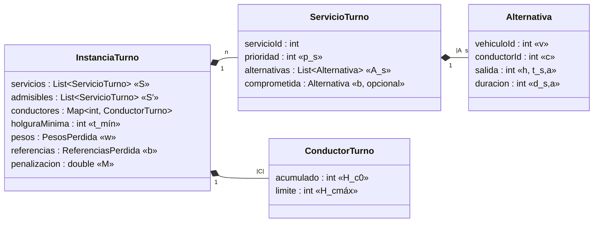
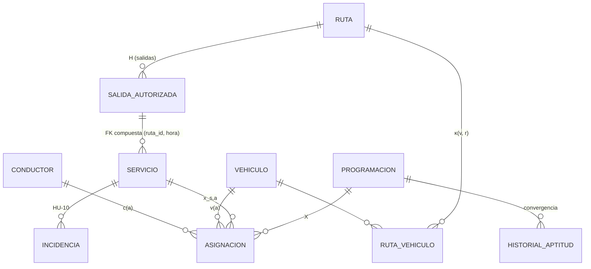

# Formalización: ecuación → pseudocódigo → código

Este documento toma el método central de la solución —la **evaluación de una
programación con la función de aptitud F(X)** y el **algoritmo genético** que
la maximiza (sección 3.4 de la tesis)— y lo recorre en tres representaciones
que se corresponden una a una:

1. la **ecuación** del modelo matemático (capítulo III, ecuaciones 1 a 8 y 15),
2. el **pseudocódigo** de la Tabla 22,
3. el **código** en Dart de `paquetes/dominio/lib/src/optimizacion/`.

Al final se relaciona con la estructura de datos en memoria y con la
topología de la base de datos (sección 5) y se analiza su complejidad
(sección 6). Las referencias `archivo:línea` apuntan a la versión `v1.0.0`.

> Todas las rutas de código son relativas a `paquetes/dominio/lib/src/` salvo
> que se indique otra carpeta.

---

## 1. Alternativas admisibles A_s (ecuación 1)

### Ecuación

```text
A_s = {(v, c, h) ∈ V × C × H_s : E_v(h) = 1, E_c(h) = 1, Q_v ≥ q_s,
                                 κ(v, r(s)) = 1, λ(c, v) = 1,
                                 [t_{s,h}, t_{s,h} + d_{s,h}] ⊆ T_c}          (1)
```

### Pseudocódigo

```text
FUNCIÓN ConstruirInstancia(datos del turno)
  V⁺ ← {v ∈ V : E_v = 1}                                  -- operativos
  C⁺ ← {c ∈ C : E_c = 1 ∧ licencia vigente ∧ H_c0 < H_cmáx}
  PARA cada servicio s, en orden de hora solicitada:
     H_s ← salidas autorizadas de r(s) en [hora_s, hora_s + tolerancia]
     A_s ← ∅
     PARA cada h ∈ H_s;  d ← d_{s,h} (duración de la salida o de la ruta)
        PARA cada v ∈ V⁺ con Q_v ≥ q_s y κ(v, r(s)) = 1
           PARA cada c ∈ C⁺ con λ(c, v) = 1 y [h, h + d] ⊆ T_c
              A_s ← A_s ∪ {(v, c, h, d)}
     SI A_s = ∅ ENTONCES registrar el motivo (incidencia u_s = 1)
  DEVOLVER instancia (S, A_s, H_c0, H_cmáx, t_mín, w, b, M)
```

### Código — `optimizacion/constructor_instancia.dart`

| Pseudocódigo | Línea | Código |
|---|---|---|
| `V⁺ ← {v : E_v = 1}` | 52–54 | `datos.vehiculos.where((v) => v.disponible)` |
| `C⁺ ← {c : E_c = 1 ∧ vigente ∧ H_c0 < H_cmáx}` | 57–61 | `c.disponible && c.licenciaVigente(datos.fecha) && c.minutosAcumulados < c.limiteMinutos` |
| orden por hora solicitada | 63–66 | `servicios.sort(...)` |
| `H_s` | 138–149 | `_salidasCandidatas(servicio, salidasRuta)` |
| `d ← d_{s,h}` | 79 | `salida.duracionMin ?? ruta.duracionMin` |
| `Q_v ≥ q_s ∧ κ(v, r(s)) = 1` | 81–82 | `v.capacidad < servicio.capacidadRequerida \|\| !compatibles.contains(v.id)` |
| `λ(c, v) = 1` | 85 | `parametros.habilita(c.categoriaLicencia, v.categoria)` |
| `[h, h + d] ⊆ T_c` | 86 | `h < c.turnoInicio \|\| h + d > c.turnoFin` |
| `A_s ← A_s ∪ {(v, c, h, d)}` | 87–92 | `alternativas.add(Alternativa(...))` |
| `A_s = ∅ → motivo` | 105–107 | `motivoSinAlternativas: _diagnosticar(...)` |

Pruebas: `paquetes/dominio/test/constructor_instancia_test.dart` (un caso por
condición de la ecuación y los escenarios HU-02, HU-03 y HU-07).

---

## 2. Función de aptitud F(X) (ecuaciones 4 a 8)

### Ecuaciones

```text
γ(a, a′) ⇔ [v(a) = v(a′) ∨ c(a) = c(a′)] ∧ t_a < t_a′ + d_a′ + t_mín ∧ t_a′ < t_a + d_a + t_mín   (4)

máx F(X) = −[ M·Φ(X) + E(X) + J(X) ]                                                     (7)
J(X)     = w_Ret·Ret/b_Ret + w_R·R/b_R + w_Tm·Tm/b_Tm + w_D·D/b_D                        (8)

Φ(X) = Cv(X) + Cc(X) + N_exc(X)
E(X) = Σ_c máx(0, H_c0 + ℓ_c(X) − H_cmáx)        ℓ_c(X) = Σ_{s: c(a(s)) = c} d_{s,a(s)}
Ret(X) = Σ_{s con b(s)} máx(0, t_{s,a(s)} − t_{s,b(s)})     R(X) = |{s con b(s) : a(s) ≠ b(s)}|
Tm(X) = Σ_v Σ_k máx(0, inicio_{k+1} − fin_k)      (servicios del vehículo v ordenados)
D(X)  = desviación estándar poblacional de ℓ_c entre los conductores con servicios
```

### Pseudocódigo

```text
FUNCIÓN Evaluar(X)                                   -- X: servicio → alternativa elegida
  Cv ← 0; Cc ← 0
  PARA cada par {a, a′} de alternativas elegidas:
     SI γ(a, a′) ENTONCES  SI v(a) = v(a′) ENTONCES Cv ← Cv + 1 SINO Cc ← Cc + 1
  ℓ_c ← Σ duraciones de los servicios de c, para cada conductor c
  E ← Σ_c máx(0, H_c0 + ℓ_c − H_cmáx);  N_exc ← |{c : H_c0 + ℓ_c > H_cmáx}|
  PARA cada s con programación comprometida b(s):
     SI s no está en X ENTONCES R ← R + 1
     SINO Ret ← Ret + máx(0, t_{a(s)} − t_{b(s)});  SI a(s) ≠ b(s) ENTONCES R ← R + 1
  Tm ← Σ huecos entre servicios consecutivos de cada vehículo
  D ← desviación estándar de {ℓ_c}
  J ← w_Ret·Ret/b_Ret + w_R·R/b_R + w_Tm·Tm/b_Tm + w_D·D/b_D
  DEVOLVER F = −(M·(Cv + Cc + N_exc) + E + J)
```

### Código — `optimizacion/evaluador.dart`

| Ecuación / pseudocódigo | Línea | Código |
|---|---|---|
| γ(a, a′), ecuación (4) | 13–16 | `enConflicto(a, b, holguraMinima)` |
| decodificación α → X, ecuación (15) | 45–48 | `decodificar(alfa)` |
| Cv, Cc (cada par una vez) | 60–71 | doble bucle `i < j` |
| ℓ_c(X) | 74–77 | `cargas[a.conductorId] += a.duracion` |
| E(X), N_exc | 80–90 | `sobra = acumulado + carga − limite` |
| Ret(X), R(X) | 93–105 | `servicio.comprometida` |
| Tm(X) | 108–118 | `porVehiculo`, orden por inicio |
| D(X) | 122–128 | media y varianza poblacional |
| J(X), ecuación (8) | 131–136 | `perdida = w.retraso * retraso / b.retraso + …` |
| F(X), ecuación (7) | 150 | `-(instancia.penalizacion * componentes.phi + exceso + perdida)` |

Pruebas: `paquetes/dominio/test/evaluador_test.dart` reproduce el ejemplo de la
Tabla 21 de la tesis (α = (0, 0, 1, 0) es factible; α = (1, 0, 0, 0) tiene
Cv = 1 y Cc = 1) y comprueba que toda solución factible supera a cualquier
infactible (efecto de M).

---

## 3. Algoritmo genético (Tabla 22 y ecuación 15)

El cromosoma es `α = (α_1, …, α_n)`, `α_s ∈ {0, …, |A_s| − 1}` (15): el gen `s`
es el **índice** de la alternativa elegida en la lista `A_s`. La restricción
(3) —cada servicio exactamente una vez— se cumple por construcción; (5) y (6)
se atienden con la reparación dirigida y con la penalización M.

### Pseudocódigo (Tabla 22) ↔ código (`optimizacion/algoritmo_genetico.dart`)

Cada línea del pseudocódigo está copiada como comentario encima del bloque
que la implementa, de modo que la correspondencia se verifica leyendo el
archivo.

| # | Pseudocódigo de la Tabla 22 | Líneas | Implementación |
|---|---|---|---|
| 1 | `S' ← {s ∈ S : A_s ≠ ∅}`; reportar A_s = ∅ como incidencia | 33–47 | `instancia.admisibles`; las incidencias las marca `Decodificador` |
| 2 | `P(0) ← P cromosomas con α_s aleatorio` | 49–56 | `aleatorio.nextInt(servicios[i].alternativas.length)` |
| 3 | `PARA cada α en P(0): α ← Reparar(α)` | 53 | `reparador.reparar(...)` |
| 4 | `Evaluar F(α) para cada α en P(0)` | 58–59 | `evaluador.evaluar(alfa).aptitud` |
| 5 | `α_mejor ← mejor de P(0); g ← 0; sin_mejora ← 0` | 61–67 | `_indiceMejor`, `historial` |
| 6 | `MIENTRAS g < G_máx Y sin_mejora < g_conv Y tiempo < t_lím` | 69–72 | `while (...)` con `Stopwatch` |
| 7 | `Q ← los redondeo(ε·P) mejores de P(g)` | 73–80 | `orden.take(p.numeroElites)` |
| 8 | `MIENTRAS \|Q\| < P` | 82–84 | `while (siguiente.length + hijos.length < P)` |
| 9 | `padre1, padre2 ← Torneo(P(g), k)` | 85–87, 139–148 | `_torneo` (k con reemplazo) |
| 10 | `SI aleatorio() < p_c ENTONCES CruceUniforme SINO copia` | 89–93, 150–154 | `_cruceUniforme` |
| 11 | `SI aleatorio() < p_m ENTONCES Mutar(hijo)` | 95–98, 156–169 | `_mutar` (un gen, otra alternativa) |
| 12 | `hijo ← Reparar(hijo); Q ← Q ∪ {hijo}` | 100–101 | `hijos.add(reparador.reparar(hijo))` |
| 13 | `Evaluar F de los nuevos cromosomas de Q` | 104–106 | `aptitudesSiguiente.addAll(...)` |
| 14 | `P(g+1) ← Q; g ← g + 1` | 108–111 | `poblacion = siguiente` |
| 15 | `SI F(mejor) > F(α_mejor) … SINO sin_mejora + 1` | 113–123 | actualización de `mejor` y `sinMejora` |
| 16 | `X_mejor ← Decodificar(α_mejor)` | 126–136 | `ResultadoOptimizacion(cromosoma: mejor)` |
| 17 | `Reportar los conflictos residuales como incidencias` | `decodificador.dart` 29–114 | `Decodificador.decodificar` |

La **reparación dirigida** (sección 3.4.9) está en `optimizacion/reparacion.dart`:
paso 1 (conflictos de Γ, líneas 24–33), paso 2 (exceso de conducción, 35–52) y
hasta ϱ = 5 pasadas (21, 55). Es determinista: no usa el generador aleatorio.

El **validador independiente** (`optimizacion/validador.dart`, 62–112)
recalcula Φ con un algoritmo distinto (barrido por recurso ordenado por hora
de inicio) para no depender del evaluador que el propio método optimiza;
`evaluador_test.dart` verifica que ambos coinciden en 300 cromosomas aleatorios.

---

## 4. Isomorfismo biunívoco documentación ↔ código

Cada símbolo del modelo tiene **un único** identificador en el código y cada
identificador del núcleo representa **un único** símbolo. La tabla se puede
leer en los dos sentidos.

| Símbolo (tesis) | Significado | Identificador en el código | Columna en MySQL |
|---|---|---|---|
| S | servicios del turno | `InstanciaTurno.servicios` | `servicio` |
| S′ | servicios con A_s ≠ ∅ | `InstanciaTurno.admisibles` | — |
| V | vehículos | `Vehiculo` | `vehiculo` |
| E_v | disponibilidad del vehículo | `Vehiculo.disponible` | `vehiculo.estado = 'operativo'` |
| Q_v | capacidad | `Vehiculo.capacidad` | `vehiculo.capacidad` |
| C | conductores | `Conductor`, `ConductorTurno` | `conductor` |
| E_c | disponibilidad del conductor | `Conductor.disponible` ∧ `licenciaVigente` | `conductor.disponible`, `vencimiento_licencia` |
| T_c | turno | `Conductor.turnoInicio`, `turnoFin` | `conductor.turno_inicio`, `turno_fin` |
| H_c0 | conducción acumulada | `ConductorTurno.acumulado` | `conductor.minutos_acumulados` |
| H_cmáx | límite de conducción | `ConductorTurno.limite` | `conductor.limite_minutos` |
| r(s) | ruta del servicio | `ServicioProgramado.rutaId` | `servicio.ruta_id` |
| κ(v, r) | compatibilidad vehículo–ruta | `Ruta.vehiculosCompatibles` | `ruta_vehiculo` |
| λ(c, v) | licencia habilitante | `ParametrosModelo.habilita` | `config/parametros.yaml` |
| H_s | salidas candidatas | `_salidasCandidatas` | `salida_autorizada` |
| d_{s,h} | duración | `Alternativa.duracion` | `salida_autorizada.duracion_min` o `ruta.duracion_min` |
| q_s | capacidad requerida | `ServicioTurno.capacidadRequerida` | `servicio.capacidad_requerida` |
| p_s | prioridad | `ServicioTurno.prioridad` | `servicio.prioridad` |
| A_s | alternativas admisibles | `ServicioTurno.alternativas` | — (se calcula) |
| a = (v, c, h) | alternativa | `Alternativa(vehiculoId, conductorId, salida)` | `asignacion.vehiculo_id`, `conductor_id`, `salida` |
| t_{s,a} | hora de inicio | `Alternativa.inicio` | `asignacion.salida` |
| x_{s,a} = 1 | decisión | gen `α_s` / fila de `asignacion` | `asignacion` |
| u_s = 1 | servicio sin cobertura | `ResultadoServicio.incidencia` | `asignacion.estado = 'incidencia'` |
| b(s) | programación comprometida | `ServicioTurno.comprometida` | `asignacion` de la programación aprobada |
| Γ, γ | pares en conflicto | `enConflicto()` (implícito) | — |
| t_mín | holgura mínima | `InstanciaTurno.holguraMinima` | `config/parametros.yaml` |
| ℓ_c(X) | carga del conductor | `Evaluacion.cargas[c]` | — |
| Cv, Cc, N_exc | conflictos y excedidos | `ComponentesAptitud.conflictosVehiculo`, `conflictosConductor`, `conductoresExcedidos` | `programacion.conflictos_vehiculo`, … |
| Φ(X) | restricciones duras incumplidas | `ComponentesAptitud.phi` / `ResultadoValidacion.phi` | `programacion.phi`, `phi_validador` |
| E(X) | exceso de conducción | `ComponentesAptitud.excesoMin` | `programacion.exceso_min` |
| Ret, R, Tm, D | criterios blandos | `retrasoMin`, `reprogramados`, `tiempoMuertoMin`, `desviacionCarga` | columnas homónimas de `programacion` |
| J(X) | pérdida | `ComponentesAptitud.perdida` | `programacion.perdida` |
| w_j | pesos | `PesosPerdida` | `config/parametros.yaml` |
| b_j | referencias | `ReferenciasPerdida` | `config/parametros.yaml` |
| M | penalización | `InstanciaTurno.penalizacion` | `config/parametros.yaml` |
| F(X) | aptitud | `Evaluacion.aptitud` | `programacion.aptitud` |
| α | cromosoma | `List<int> cromosoma` | — |
| P, G_máx, p_c, p_m, k, ε, g_conv, t_lím, ϱ | parámetros del AG | `ParametrosAG.tamanoPoblacion`, `generacionesMaximas`, `probabilidadCruce`, `probabilidadMutacion`, `tamanoTorneo`, `proporcionElite`, `generacionesSinMejora`, `limiteTiempo`, `pasadasReparacion` | `config/parametros.yaml` |
| curva de convergencia | mejor y promedio por generación | `PuntoConvergencia` | `historial_aptitud` |

---

## 5. Relación con la estructura de datos

### 5.1 En memoria



* **A_s como lista indexada.** El gen `α_s` es la posición en
  `ServicioTurno.alternativas`; decodificar es un acceso por índice, `O(1)`
  por gen, y el cruce uniforme y la mutación nunca producen un valor fuera de
  `A_s` (por eso no hay soluciones con recursos no disponibles).
* **Γ implícito.** El conjunto de pares en conflicto de la ecuación (4) no se
  materializa: su tamaño `p` crece con `K²`. El predicado `enConflicto` se
  evalúa solo sobre las `n` alternativas elegidas (ver sección 6 y
  `docs/decisiones_y_desviaciones.md`).
* **Mapas por clave.** `conductores` (id → `H_c0`, `H_cmáx`) y `cargas`
  (id → `ℓ_c`) dan acceso `O(1)` al calcular `E(X)` y en la reparación.

### 5.2 En la base de datos (topología)



* **La base garantiza parte de la ecuación (1).** La clave foránea compuesta
  `servicio(ruta_id, hora_solicitada) → salida_autorizada(ruta_id, hora)` hace
  imposible registrar un servicio a una hora no autorizada; `ruta_vehiculo`
  es exactamente la relación N:M `κ(v, r)`.
* **Una programación aprobada por fecha.** La columna generada
  `programacion.fecha_aprobada = IF(estado = 'aprobada', fecha, NULL)` con
  índice único implementa la regla de HU-09 en la propia base.
* **x_{s,a} como filas.** Cada fila de `asignacion` es un `x_{s,a} = 1`; la
  restricción `ck_asignacion_recursos` impide una incidencia con recursos o
  una asignación sin ellos.
* **Lectura → instancia.** `ProgramacionServicio._instancia`
  (`servidor/lib/src/servicios/programacion_servicio.dart`) lee servicios,
  vehículos, conductores, rutas, salidas y la programación comprometida con
  los repositorios y llama a `ConstructorInstancia`; el núcleo no conoce la
  base de datos (RNF-07).
* **Resultado → filas.** La programación, sus asignaciones y su curva se
  guardan en una transacción (`BaseDatos.transaccion`); si algo falla, no
  queda una programación a medias.

---

## 6. Complejidad

Sea `n = |S′|`, `k = máx |A_s|`, `K = Σ |A_s| ≤ n·k`, `|V|` y `|C|` los
recursos disponibles, `P` la población, `G` las generaciones ejecutadas y
`ϱ` las pasadas de reparación.

| Etapa | Tiempo | Espacio | Comentario |
|---|---|---|---|
| Construir A_s (ec. 1) | `O(n·|H_s|·|V|·|C|)` | `O(K)` | filtros en `O(1)` por combinación |
| Evaluar F(X) | `O(n² + n log n)` | `O(n)` | pares elegidos (Cv, Cc) y orden por vehículo (Tm) |
| Reparar (por pasada) | `O(n² + c·k·n)` | `O(n)` | `c` conflictos; cada reasignación revisa `k` alternativas contra `n` servicios |
| Una generación | `O(P·(n² + ϱ·(n² + c·k·n)))` | `O(P·n)` | evaluar y reparar los descendientes |
| AG completo | `O(G·P·(n² + ϱ·(n² + c·k·n)))` | `O(P·n + K)` | `G ≤ G_máx = 100`, corte por `g_conv` y `t_lím` |
| Validador | `O(n log n + m)` | `O(n)` | barrido por recurso; `m` cruces encontrados |

La tesis estima `O(G·P·(p + n²))` con Γ precalculado (`p = |Γ|`). Como aquí
Γ es implícito, la evaluación cuesta `O(n²)` en lugar de `O(p + K + n log n)`
y la memoria baja de `O(P·n + K + p)` a `O(P·n + K)`; con `n ≤ 112` el término
`n²` es pequeño y evita guardar `p`, que crecería con `K²`.

**Tiempos medidos** (`dart run paquetes/dominio/tool/experimento.dart`;
protocolo de la Tabla 17 de la tesis: 3 instancias por tamaño, 10 semillas del
AG; Intel Xeon 2,1 GHz, 4 núcleos, un hilo):

| n | AG: tiempo medio | AG: brecha media | AG: Φ medio | Voraz: brecha media | Voraz: Φ medio |
|---:|---:|---:|---:|---:|---:|
| 7 | 0,015 s | 0,00 % | 0 | 33,33 % | 0,33 |
| 14 | 0,027 s | 0,00 % | 0 | 3,51 % | 0 |
| 28 | 0,050 s | 0,00 % | 0 | 66,67 % | 5,67 |
| 56 | 0,110 s | 0,00 % | 0 | 100,00 % | 12,67 |
| 112 | 0,325 s | 0,00 % | 0 | 100,00 % | 36,00 |

La brecha es la diferencia relativa con el óptimo exacto (n = 7, enumeración
exhaustiva) o con la mejor solución observada (n ≥ 14). El AG cumple RNF-01
(Φ = 0) y RNF-02 (≤ 300 s para 28 servicios) con amplio margen. Las semillas
del AG convergen a la misma solución: las instancias sintéticas tienen una
región factible estrecha, por lo que estos resultados no son comparables con
la Tabla 19 de la tesis, obtenida con PyGAD sobre otras instancias.
