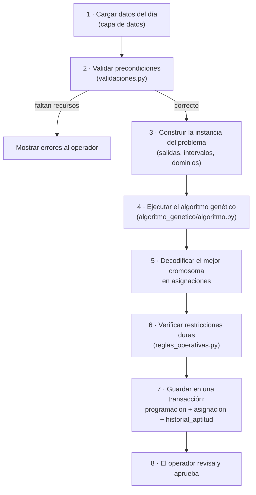
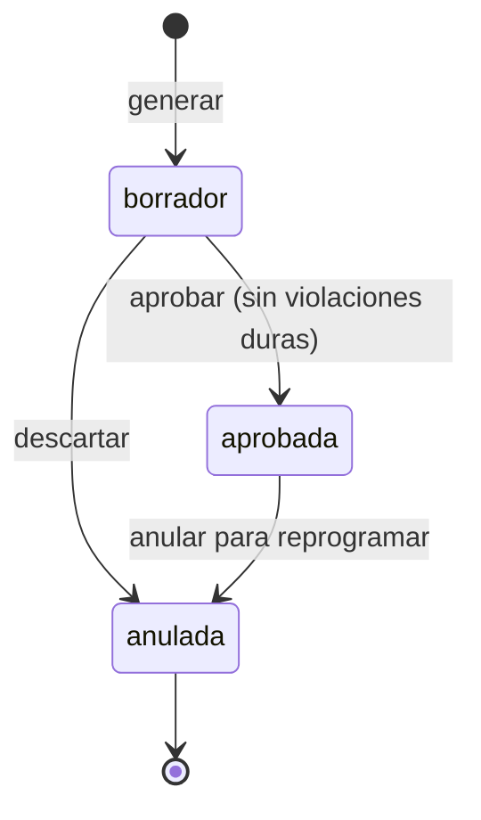
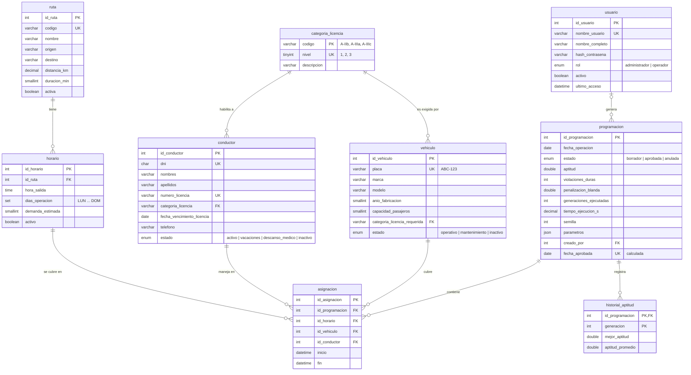

# Métodos, modelos y algoritmos

Este documento describe la lógica principal del sistema, el modelo de datos
y las reglas que aplica. El algoritmo genético se detalla en
[Teoría del algoritmo genético](teoria_algoritmo_genetico.md) y la
organización en capas en [Arquitectura](arquitectura.md).

## 1. Problema que resuelve

Cada día la empresa debe decidir **qué vehículo y qué conductor cubren cada
salida programada** de cada ruta. Una programación válida debe cumplir las
reglas operativas (un vehículo o conductor no puede estar en dos salidas a
la vez, la licencia debe corresponder al vehículo, se respeta la jornada
máxima y los descansos). Entre las programaciones válidas se prefieren las
que reparten mejor el trabajo y asignan vehículos con capacidad suficiente.

El número de combinaciones crece de forma exponencial. Con los datos de
ejemplo, un lunes hay 18 salidas, 7 vehículos y 10 conductores disponibles,
es decir, (7 × 10)¹⁸ ≈ 1,6 × 10³³ programaciones posibles. Es imposible
revisarlas todas, por eso se usa una **metaheurística** (un algoritmo
genético) que encuentra soluciones de buena calidad en segundos.

## 2. Lógica principal: generación de la programación

El caso de uso principal lo coordina `src/logica/generador_programacion.py`:

### Paso 1. Cargar los datos del día

Para la fecha elegida se obtienen, con consultas parametrizadas:

| Dato | Condición |
|---|---|
| **Salidas** | Horarios activos de rutas activas cuyo `dias_operacion` incluye el día de la semana de la fecha (`FIND_IN_SET(%s, dias_operacion)`), ordenados por hora |
| **Vehículos disponibles** | `estado = 'operativo'` |
| **Conductores disponibles** | `estado = 'activo'` y `fecha_vencimiento_licencia >= fecha` |

Al filtrar aquí, las reglas *vehículo operativo* y *licencia vigente* se
cumplen siempre: el algoritmo nunca ve recursos no disponibles.

### Paso 2. Validar precondiciones

Antes de ejecutar el algoritmo se comprueba que el problema tenga solución:

- Hay al menos una salida, un vehículo y un conductor.
- **Simultaneidad máxima:** se recorren los intervalos de las salidas en orden
  de inicio y se calcula el mayor número de salidas que ocurren a la vez. Si
  supera al número de vehículos o de conductores disponibles, no existe
  ninguna programación sin solapamientos y se informa al operador cuántos
  recursos faltan y a qué hora.
- Para cada categoría de licencia que exigen los vehículos disponibles existe
  al menos un conductor capaz de manejarlos.
- Se avisa (sin bloquear) de las licencias que vencen en menos de
  `dias_alerta_vencimiento_licencia` días.

### Paso 3. Construir la instancia del problema

Cada salida *i* se convierte en un intervalo de tiempo:

- inicio *aᵢ* = fecha + `horario.hora_salida`
- fin *bᵢ* = *aᵢ* + `ruta.duracion_min`
- demanda *qᵢ* = `horario.demanda_estimada`

Un vehículo queda ocupado durante [*aᵢ*, *bᵢ* + tiempo de alistamiento) y un
conductor durante [*aᵢ*, *bᵢ* + descanso mínimo). Ambos tiempos se leen de
`reglas_operativas` en `config/parametros_ga.yaml`.

**Supuesto del modelo:** cada servicio empieza y termina en el terminal, por
lo que al terminar un servicio el vehículo y el conductor pueden tomar
cualquier otra salida. `ruta.duracion_min` es el tiempo total de ida y vuelta.

### Pasos 4 y 5. Ejecutar el algoritmo y decodificar

El algoritmo genético recibe la instancia y los parámetros y devuelve el
mejor cromosoma, su aptitud y el historial de aptitud por generación. El
cromosoma se decodifica en una lista de asignaciones
(salida, vehículo, conductor, inicio, fin). Ver
[Teoría del algoritmo genético](teoria_algoritmo_genetico.md).

### Paso 6. Verificar el resultado

Se vuelven a evaluar las restricciones duras sobre la solución decodificada,
con las mismas funciones de `reglas_operativas.py`. Si queda alguna violación
(porque los recursos no alcanzan), la programación se guarda igualmente como
**borrador**, con el detalle de cada violación, para que el operador la
corrija a mano o agregue recursos.

### Pasos 7 y 8. Guardar y aprobar

La programación, sus asignaciones y el historial de aptitud se guardan en
**una sola transacción** (`obtener_conexion()` hace `commit` al final o
`rollback` si hay error). El ciclo de vida de una programación es:

Solo puede haber **una programación aprobada por fecha**. Lo garantiza la base
de datos mediante la columna calculada `fecha_aprobada` y su índice único.

## 3. Modelo de datos

Base de datos MySQL 8.4 (`src/datos/esquema.sql`), motor InnoDB y juego de
caracteres `utf8mb4`.

### Diagrama entidad-relación

### Diccionario de datos

| Tabla | Qué representa | Claves y restricciones principales |
|---|---|---|
| `usuario` | Personas que usan el sistema | `nombre_usuario` único; `rol` ∈ {administrador, operador}; la contraseña se guarda como hash |
| `categoria_licencia` | Catálogo de licencias para transporte de pasajeros | `nivel` único y ordenado: un conductor puede manejar un vehículo si su nivel es mayor o igual al que exige el vehículo |
| `vehiculo` | Unidades de la flota | `placa` única; `capacidad_pasajeros > 0`; `anio_fabricacion ≥ 1980`; FK a la categoría de licencia que exige |
| `conductor` | Conductores de la empresa | `dni` único de 8 dígitos (`CHECK`); `numero_licencia` único; FK a su categoría |
| `ruta` | Recorridos que opera la empresa | `codigo` único; `distancia_km > 0`; `duracion_min > 0` (ida y vuelta) |
| `horario` | Salidas recurrentes de una ruta | Una ruta no puede tener dos salidas a la misma hora (`UNIQUE (id_ruta, hora_salida)`); `dias_operacion` es un `SET` de días |
| `programacion` | Una ejecución del algoritmo para una fecha | Aptitud entre 0 y 1 (`CHECK`); copia JSON de los parámetros y la semilla; una sola aprobada por fecha (índice único sobre `fecha_aprobada`) |
| `asignacion` | Resultado: vehículo y conductor de cada salida | Una fila por salida y programación (`UNIQUE (id_programacion, id_horario)`); `fin > inicio`; se borra en cascada con su programación |
| `historial_aptitud` | Mejor aptitud y aptitud promedio por generación | Clave `(id_programacion, generacion)`; alimenta la curva de convergencia |
| `v_asignacion_detalle` (vista) | Asignaciones con placa, conductor, ruta y demanda en texto legible | Usada por los reportes |

### Relación entre los datos y el algoritmo

| Tablas | Papel en el algoritmo |
|---|---|
| `horario` + `ruta` | Definen las salidas a cubrir (los "genes" del cromosoma) y su intervalo de tiempo |
| `vehiculo`, `conductor`, `categoria_licencia` | Definen los valores posibles de cada gen y las compatibilidades de licencia |
| `programacion`, `asignacion`, `historial_aptitud` | Guardan la salida del algoritmo, sus métricas y su trazabilidad |

### Modelos en memoria (capa de lógica)

Para que el algoritmo no dependa de la base de datos, la capa de lógica
trabaja con estructuras propias, construidas en el paso 3:

| Estructura | Campos |
|---|---|
| `Salida` | `id_horario`, `codigo_ruta`, `inicio`, `fin`, `demanda` |
| `VehiculoDisponible` | `id_vehiculo`, `placa`, `capacidad`, `nivel_licencia_requerido` |
| `ConductorDisponible` | `id_conductor`, `nombre`, `nivel_licencia` |
| `InstanciaProblema` | `fecha`, lista ordenada de `Salida`, listas de recursos disponibles, `reglas_operativas` |
| `ResultadoProgramacion` | Asignaciones, aptitud, violaciones por tipo, penalización blanda, historial, generaciones, tiempo, semilla |

## 4. Reglas operativas (`reglas_operativas.py`)

| Código | Regla | Tipo | Cómo se garantiza | Parámetro (`parametros_ga.yaml`) |
|---|---|---|---|---|
| R1 | Solo se programan vehículos operativos | Dura | Filtro al cargar datos | — |
| R2 | Solo se programan conductores activos con licencia vigente en la fecha | Dura | Filtro al cargar datos | — |
| R3 | Un vehículo no cubre dos salidas que se solapan, contando el alistamiento | Dura | Penalización + reparación | `tiempo_alistamiento_vehiculo_min` |
| R4 | Un conductor no cubre dos salidas que se solapan, contando su descanso | Dura | Penalización + reparación | `descanso_minimo_entre_servicios_min` |
| R5 | La categoría de licencia del conductor alcanza la que exige el vehículo | Dura | Penalización + reparación | — |
| R6 | Las horas de conducción del día no superan la jornada máxima | Dura | Penalización + reparación | `max_horas_conduccion_dia` |
| R7 | La capacidad del vehículo cubre la demanda estimada de la salida | Blanda | Penalización | `capacidad_insuficiente` |
| R8 | La carga de trabajo se reparte de forma equitativa entre conductores | Blanda | Penalización | `equidad_conductores` |
| R9 | El uso de los vehículos está balanceado | Blanda | Penalización | `balance_flota` |

Una regla **dura** debe cumplirse para que la programación sea factible; una
regla **blanda** mide la calidad de una programación factible. Los valores
por defecto de R3, R4 y R6 son configurables y deben ajustarse a la política
de la empresa y a la normativa de transporte vigente.

## 5. Validaciones de datos (`validaciones.py`)

Se aplican en los formularios antes de guardar. Las más importantes también
están reforzadas en la base de datos con `CHECK`, `UNIQUE` y claves foráneas.

| Dato | Regla | Ejemplo válido |
|---|---|---|
| Placa | `^[A-Z0-9]{3}-[0-9]{3}$` y única | `SFA-101` |
| DNI | Exactamente 8 dígitos y único | `70000001` |
| Número de licencia | Alfanumérico, 9 a 12 caracteres, sin espacios, único | `Q70000001` |
| Fecha de vencimiento de licencia | Fecha válida; aviso si vence en menos de `dias_alerta_vencimiento_licencia` días | `2028-03-15` |
| Capacidad de pasajeros | Entero mayor que 0 | `30` |
| Año de fabricación | Entre 1980 y el año siguiente al actual | `2021` |
| Distancia y duración de ruta | Mayores que 0 | `18.5` km, `90` min |
| Horario | Hora en formato `HH:MM`, al menos un día de operación, demanda ≥ 0 | `06:30`, `LUN,MAR` |
| Nombre de usuario | 4 a 50 caracteres: letras minúsculas, dígitos, `.` o `_` | `operador.turno1` |
| Contraseña | Al menos 8 caracteres | — |

## 6. Autenticación y roles (`login.py`)

- **Hash de contraseñas:** PBKDF2-HMAC-SHA256 del módulo estándar `hashlib`,
  con sal aleatoria de 16 bytes (`secrets.token_bytes`) y 600 000
  iteraciones. Se guarda como
  `pbkdf2_sha256$<iteraciones>$<sal_base64>$<hash_base64>` y se compara con
  `hmac.compare_digest` para no filtrar información por tiempos de respuesta.
- **Permisos por rol:**

| Acción | Administrador | Operador |
|---|:---:|:---:|
| Gestionar vehículos, conductores, rutas y horarios | ✔ | Solo consulta |
| Gestionar usuarios | ✔ | — |
| Generar programaciones | ✔ | ✔ |
| Aprobar o anular programaciones | ✔ | — |
| Ver reportes y resultados | ✔ | ✔ |

## 7. Visualización y reportes

| Salida | Fuente | Para qué sirve |
|---|---|---|
| Curva de convergencia (mejor aptitud y aptitud promedio por generación) | `historial_aptitud` | Ver si el algoritmo convergió o necesita más generaciones |
| Diagrama de Gantt por vehículo y por conductor | `asignacion` | Revisar visualmente solapamientos y tiempos muertos |
| Indicadores de la programación | `asignacion`, `programacion` | Salidas cubiertas, violaciones, pasajeros no atendidos, horas por conductor (mínimo, máximo, desviación estándar), uso de la flota, generaciones, tiempo de ejecución |
| Exportación a CSV | `v_asignacion_detalle` | Entregar la programación a los conductores y a la oficina; se guarda en `salidas/`, que no se sube al repositorio |
