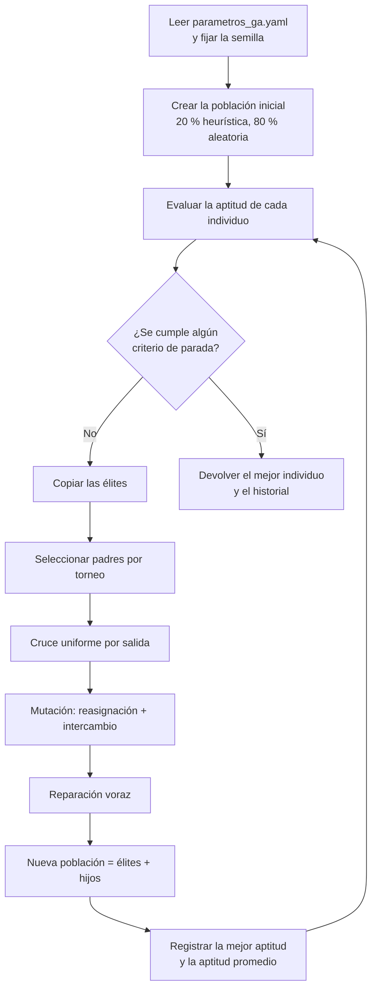

# Teoría del algoritmo genético

Este documento explica el algoritmo genético (AG) que genera la programación
operativa: cómo se representa una solución, cómo se mide su calidad y qué
operadores la mejoran. Los módulos están en `src/logica/algoritmo_genetico/`
y los parámetros en `config/parametros_ga.yaml`. El contexto general está en
[Métodos, modelos y algoritmos](metodos_modelos_algoritmos.md).

## 1. Fundamentos

Un algoritmo genético es una metaheurística inspirada en la evolución
natural. Mantiene una **población** de soluciones candidatas
(**individuos**), cada una codificada como un **cromosoma**. En cada
**generación**:

1. Se mide la calidad de cada individuo con una **función de aptitud**.
2. Se **seleccionan** padres, favoreciendo a los más aptos.
3. Se combinan los padres mediante **cruce** para formar hijos.
4. Se aplican **mutaciones** pequeñas y aleatorias para mantener la diversidad.
5. Los mejores individuos pasan sin cambios a la siguiente generación (**elitismo**).

El proceso se repite hasta que se cumple un **criterio de parada**.

**¿Por qué un AG?** La asignación de vehículos y conductores a servicios con
ventanas de tiempo es un problema combinatorio de la familia de los
problemas de programación de vehículos y tripulaciones (*vehicle and crew
scheduling*), que en sus formas generales es NP-difícil. Un AG no garantiza
el óptimo, pero explora espacios enormes de forma eficiente, admite
restricciones mediante penalizaciones y entrega varias soluciones buenas en
un tiempo controlado.

## 2. Notación

| Símbolo | Significado |
|---|---|
| *S* = {*s*₁, …, *s*ₙ} | Salidas del día, ordenadas por hora de inicio |
| *aᵢ*, *bᵢ* | Inicio y fin de la salida *i* |
| *qᵢ* | Demanda estimada de la salida *i* (pasajeros) |
| *V* | Vehículos disponibles; *k*(*v*) es la capacidad y ℓ(*v*) el nivel de licencia que exige |
| *C* | Conductores disponibles; λ(*c*) es el nivel de su licencia |
| *t*_A | Tiempo de alistamiento del vehículo entre salidas |
| *t*_D | Descanso mínimo del conductor entre salidas |
| *H*_max | Jornada máxima de conducción por día (horas) |
| *x* | Cromosoma (una programación completa) |
| *f*(*x*) | Aptitud del cromosoma, entre 0 y 1 |

## 3. Representación del cromosoma (`cromosoma.py`)

Codificación **entera** de longitud 2*N*. Para cada salida hay un par de
genes contiguos: el identificador del vehículo y el del conductor.

```math
x = (\,v_1, c_1,\; v_2, c_2,\; \dots,\; v_N, c_N\,), \qquad v_i \in V,\; c_i \in C
```

Ejemplo con cuatro salidas de los datos de ejemplo:

| Posición | 0 | 1 | 2 | 3 | 4 | 5 | 6 | 7 |
|---|---|---|---|---|---|---|---|---|
| Salida | s₁ R01 06:00 | | s₂ R02 06:30 | | s₃ R03 07:00 | | s₄ R01 08:00 | |
| Gen | vehículo | conductor | vehículo | conductor | vehículo | conductor | vehículo | conductor |
| Valor | 5 | 2 | 1 | 5 | 6 | 2 | 5 | 1 |

- **Dominio de cada gen:** los genes de vehículo toman valores en los
  identificadores de *V* y los de conductor en los de *C*. En PyGAD se
  declara con `gene_space` (una lista de valores por gen) y
  `gene_type=int`.
- **Ventajas:** toda salida queda cubierta por construcción (no hay salidas
  sin asignar), la decodificación es directa y mantener juntos los dos genes
  de una salida permite que el cruce intercambie salidas completas.
- Las reglas R1 y R2 (vehículo operativo, licencia vigente) se cumplen
  siempre, porque los recursos no disponibles no forman parte del dominio.

## 4. Población inicial (`poblacion.py`)

Se generan `poblacion.tamano` individuos (100 por defecto):

- **Heurísticos** (`proporcion_heuristica`, 20 %): se recorren las salidas en
  orden de inicio y a cada una se le asigna, **al azar entre los recursos
  libres y compatibles**, un vehículo (con preferencia por los que cubren la
  demanda) y un conductor (con preferencia por los de menor carga). Estos
  individuos suelen ser factibles desde el principio.
- **Aleatorios** (el 80 % restante): cada gen toma un valor al azar de su
  dominio. Aportan diversidad y evitan que la búsqueda converja demasiado
  pronto.

La población se entrega a PyGAD con el parámetro `initial_population`.

## 5. Función de aptitud (`aptitud.py`)

Se usa el **método de penalizaciones**: la aptitud es mayor cuanto menor es
la penalización total.

```math
f(x) = \frac{1}{1 + P_D(x) + P_B(x)} \in (0, 1]
```

```math
P_D(x) = w_1 H_1(x) + w_2 H_2(x) + w_3 H_3(x) + w_4 H_4(x)
\qquad
P_B(x) = w_5 B_1(x) + w_6 B_2(x) + w_7 B_3(x)
```

### Restricciones duras (penalización *P_D*)

| Término | Regla | Cálculo |
|---|---|---|
| *H*₁ | R3 · solapamiento de vehículo | Número de salidas cuyo vehículo todavía está ocupado (por una salida anterior más *t*_A) cuando empiezan |
| *H*₂ | R4 · solapamiento de conductor | Ídem con el conductor y su descanso *t*_D |
| *H*₃ | R5 · licencia incompatible | Número de salidas con λ(*cᵢ*) < ℓ(*vᵢ*) |
| *H*₄ | R6 · exceso de jornada | Σ de horas por encima de *H*_max, sumadas sobre todos los conductores |

```math
H_4(x) = \sum_{c \in C} \max\bigl(0,\; h_c(x) - H_{max}\bigr),
\qquad h_c(x) = \sum_{i \,:\, c_i = c} (b_i - a_i)
```

*H*₁ y *H*₂ se calculan con un **barrido**: se recorren las salidas en orden
de inicio guardando, para cada recurso, el instante en que vuelve a quedar
libre. Si una salida empieza antes de ese instante, cuenta como una
violación. El costo es O(*N* log *N*) por individuo.

### Restricciones blandas (penalización *P_B*)

| Término | Regla | Cálculo |
|---|---|---|
| *B*₁ | R7 · capacidad | Pasajeros no atendidos: Σ max(0, *qᵢ* − *k*(*vᵢ*)) |
| *B*₂ | R8 · equidad | Desviación estándar de las horas asignadas a cada conductor disponible, *h_c* (en horas) |
| *B*₃ | R9 · balance de flota | Desviación estándar de las horas de uso de cada vehículo disponible (en horas) |

### Pesos

Los pesos *w*₁ … *w*₇ están en `aptitud.pesos_restricciones_duras` y
`aptitud.pesos_restricciones_blandas`. Los pesos duros (1000) deben ser
mayores que la mayor penalización blanda posible: así cualquier solución
factible tiene mejor aptitud que cualquier solución infactible. Con los
datos de ejemplo de un lunes, el peor caso posible de *P_B* es de unas 328
unidades (255 pasajeros no atendidos si todas las salidas usan un vehículo
de 20 asientos, más 49,5 de equidad y 23,1 de balance si un solo conductor
y un solo vehículo cubren las 33 horas de servicio), por debajo de 1000.

Si *P_D* = 0 y *P_B* = 0, la aptitud vale 1. En la práctica *P_B* rara vez es
exactamente 0, por eso el criterio `aptitud_objetivo: 1.0` casi nunca
detiene el algoritmo antes de tiempo.

### Ejemplo de cálculo

Datos de ejemplo, con *t*_A = 10 min, *t*_D = 15 min y *H*_max = 10 h:

| Salida | Horario | Demanda |
|---|---|---|
| s₁ | R01 06:00–07:30 | 40 |
| s₂ | R02 06:30–08:30 | 35 |
| s₃ | R03 07:00–10:00 | 45 |
| s₄ | R01 08:00–09:30 | 35 |

Vehículos: 1 = SFA-101 (30 asientos, A-IIb), 5 = SFB-201 y 6 = SFB-202
(50 asientos, A-IIIa). Conductores: 1 = Quispe (A-IIIc), 2 = Mamani (A-IIIa),
5 = Chávez (A-IIb).

**Cromosoma *x*** (el de la sección 3): s₁→(5, 2), s₂→(1, 5), s₃→(6, 2), s₄→(5, 1).

- *H*₂ = 1: el conductor 2 termina s₁ a las 07:30 y descansa hasta las 07:45,
  pero s₃ empieza a las 07:00.
- *H*₁ = *H*₃ = *H*₄ = 0.
- *B*₁ = 5: s₂ tiene 35 pasajeros y el vehículo 1 solo 30 asientos.
- Horas por conductor (1, 2, 5) = (1,5; 4,5; 2,0) → *B*₂ = 1,312.
- Horas por vehículo (1, 5, 6) = (2,0; 3,0; 3,0) → *B*₃ = 0,471.

```math
P = 1000 \cdot 1 + 1 \cdot 5 + 5 \cdot 1.312 + 2 \cdot 0.471 = 1012.50
\quad\Rightarrow\quad f(x) = \frac{1}{1013.50} \approx 0.000987
```

**Después de la reparación** (sección 9), el conductor 1 pasa a s₃ y el 2 a s₄.
La solución queda factible: horas por conductor = (3,0; 3,0; 2,0) y
*B*₂ = 0,471.

```math
P = 5 + 5 \cdot 0.471 + 2 \cdot 0.471 = 8.30
\quad\Rightarrow\quad f = \frac{1}{9.30} \approx 0.1075
```

## 6. Selección por torneo (`seleccion.py`)

Para elegir cada padre se toman al azar *k* = `tamano_torneo` individuos (3)
y gana el de mayor aptitud. Se repite hasta reunir `num_padres` (50).

- La **presión selectiva** se regula con *k*: un torneo más grande favorece
  más a los mejores, pero reduce la diversidad.
- No depende de la escala de la aptitud (solo compara cuál es mayor), lo que
  conviene porque las penalizaciones duras hacen que las aptitudes varíen en
  varios órdenes de magnitud.
- En PyGAD: `parent_selection_type="tournament"`, `K_tournament=3`.

## 7. Cruce uniforme por salida (`cruce.py`)

Con probabilidad `cruce.probabilidad` (0,85) se cruza una pareja de padres;
en caso contrario el hijo es una copia de uno de ellos. Al cruzar, para cada
salida se lanza una moneda y el hijo hereda **el par completo
(vehículo, conductor)** de uno de los dos padres:

| Salida | s₁ | s₂ | s₃ | s₄ |
|---|---|---|---|---|
| Padre A | (5, 2) | (1, 5) | (6, 2) | (5, 1) |
| Padre B | (6, 1) | (5, 2) | (1, 5) | (6, 2) |
| Moneda | A | B | B | A |
| **Hijo** | (5, 2) | (5, 2) | (1, 5) | (5, 1) |

El hijo de este ejemplo tiene el vehículo 5 y el conductor 2 en s₁ y s₂, que
se solapan. Es normal: la reparación (sección 9) corrige esos conflictos.

Se cruza por pares y no gen a gen, porque la combinación vehículo-conductor
de una salida es una unidad con sentido (la compatibilidad de licencia
depende de ambos genes). Es un operador propio que se pasa a PyGAD como
función: `crossover_type=cruce_uniforme_por_salida(padres, tamano_hijos, ga)`.

## 8. Mutación (`mutacion.py`)

Se aplican dos operadores a cada hijo:

1. **Reasignación aleatoria:** cada gen, con probabilidad
   `probabilidad_gen` (0,05), toma otro valor al azar de su dominio. Explora
   recursos que quizá no estaban en la población.
2. **Intercambio de conductores:** con probabilidad
   `probabilidad_intercambio` (0,10) se eligen dos salidas al azar y se
   intercambian sus conductores. No cambia el total de horas de trabajo
   asignadas, pero mueve a los conductores en el tiempo, lo que ayuda a
   eliminar solapamientos.

Se pasa a PyGAD como función: `mutation_type=mutar(hijos, ga)`. Al final de
esta función se llama a la reparación.

## 9. Reparación (`reparacion.py`)

El cruce y la mutación pueden crear solapamientos. La reparación es una
heurística **voraz y determinista** que corrige las violaciones duras cuando
es posible:

1. Recorre las salidas en orden de inicio llevando la ocupación de cada
   recurso y las horas acumuladas de cada conductor.
2. Si el vehículo de la salida está ocupado, lo cambia por un vehículo libre
   cuya licencia exigida pueda cubrir el conductor, prefiriendo los que
   cubren la demanda y, entre ellos, el de menor uso.
3. Si el conductor está ocupado, no tiene licencia suficiente o superaría
   *H*_max, lo cambia por un conductor libre y compatible, el de **menor carga
   acumulada**.
4. Los empates se resuelven por el identificador menor, para que el resultado
   sea reproducible.
5. Si no hay ningún candidato válido, deja el gen como está: la violación se
   penaliza en la aptitud y la selección se encarga de descartarlo.

En el ejemplo de la sección 5: al llegar a s₃ el conductor 2 está ocupado y
el único libre y compatible es el 1; al llegar a s₄ el conductor 1 ya está
en s₃ y queda libre el 2. El resultado es el cromosoma reparado.

## 10. Elitismo (`elitismo.py`)

Los `num_elites` (2) mejores individuos de cada generación pasan sin cambios
a la siguiente. Esto garantiza que **la mejor aptitud nunca empeora** de una
generación a otra (la curva de convergencia es no decreciente). Los otros
`tamano − num_elites` individuos son hijos nuevos. En PyGAD:
`keep_elitism=2`.

## 11. Criterios de parada (`criterios_parada.py`)

El algoritmo se detiene con **el primer** criterio que se cumpla:

| Criterio | Valor por defecto | En PyGAD |
|---|---|---|
| Número máximo de generaciones | 500 | `num_generations=500` |
| Generaciones seguidas sin mejora de la mejor aptitud | 50 | `stop_criteria="saturate_50"` |
| Aptitud objetivo alcanzada | 1,0 | `stop_criteria="reach_1.0"` |
| Tiempo máximo de ejecución | 120 s | `stop_criteria="time_120"` |

Los criterios de PyGAD se pasan juntos como lista:
`stop_criteria=["saturate_50", "reach_1.0", "time_120"]`.

## 12. Algoritmo completo (`algoritmo.py`)



Pseudocódigo:

```text
función EJECUTAR_AG(instancia, parámetros):
    fijar semilla (random y numpy.random)
    P ← POBLACIÓN_INICIAL(instancia, tamaño, proporción_heurística)
    evaluar f(x) para cada x en P
    historial ← []
    g ← 0
    mientras no CRITERIO_PARADA(g, historial):
        E ← los num_elites mejores de P
        padres ← TORNEO(P, num_padres, k)
        H ← CRUCE_UNIFORME_POR_SALIDA(padres, tamaño − |E|, p_cruce)
        H ← MUTAR(H, p_gen, p_intercambio)
        H ← REPARAR(H, instancia)
        P ← E ∪ H
        evaluar f(x) para cada x en P
        agregar (máx f, promedio f) a historial
        g ← g + 1
    devolver el mejor x de P, historial
```

`algoritmo.py` arma el objeto `pygad.GA` con estos parámetros:

| Concepto | Módulo | Parámetro de `pygad.GA` | Clave en `parametros_ga.yaml` |
|---|---|---|---|
| Representación y dominio | `cromosoma.py` | `num_genes`, `gene_space`, `gene_type=int` | — |
| Población inicial | `poblacion.py` | `initial_population` | `poblacion.*` |
| Aptitud | `aptitud.py` | `fitness_func(ga, solucion, indice)` | `aptitud.*`, `reglas_operativas.*` |
| Selección | `seleccion.py` | `parent_selection_type`, `K_tournament`, `num_parents_mating` | `seleccion.*` |
| Cruce | `cruce.py` | `crossover_type` (función propia) | `cruce.*` |
| Mutación y reparación | `mutacion.py`, `reparacion.py` | `mutation_type` (función propia) | `mutacion.*` |
| Elitismo | `elitismo.py` | `keep_elitism` | `elitismo.num_elites` |
| Parada | `criterios_parada.py` | `num_generations`, `stop_criteria` | `parada.*` |
| Historial | `algoritmo.py` | `on_generation` (registra mejor y promedio) | — |
| Semilla | `algoritmo.py` | `random_seed` | `semilla_aleatoria` |

## 13. Complejidad computacional

- Evaluar un individuo: O(*N* log *N*), por el ordenamiento del barrido de
  ocupación (*N* = número de salidas).
- Una generación: O(*P* · *N* log *N*), con *P* = tamaño de la población.
- Ejecución completa: O(*G* · *P* · *N* log *N*), con *G* ≤ 500 generaciones.

Con *N* ≈ 18, *P* = 100 y *G* = 500 se hacen como máximo unas 50 000
evaluaciones, que en un equipo actual tardan pocos segundos.

## 14. Reproducibilidad

- PyGAD aplica `random_seed` a `random.seed()` y a `numpy.random.seed()`. Los
  operadores propios (población, cruce, mutación) deben usar **esos mismos
  generadores** (`random.*` o `numpy.random.*`). No deben crear generadores
  nuevos sin semilla, como `numpy.random.default_rng()`.
- La reparación es determinista: los empates se resuelven por identificador.
- Cada programación guarda la semilla y una copia de los parámetros en la
  tabla `programacion`.
- Con la misma semilla, los mismos datos y las mismas versiones de
  `requirements.txt`, el resultado es idéntico.

## 15. Ajuste de parámetros y evaluación experimental

Por ser un método estocástico, el desempeño se evalúa con varias
ejecuciones y no con una sola:

1. Fijar un escenario de datos (por ejemplo, el lunes de `datos_ejemplo.sql`).
2. Ejecutar el AG 30 veces por configuración, con semillas de 1 a 30.
3. Reportar la media y la desviación estándar de la aptitud final, el
   porcentaje de ejecuciones factibles, las generaciones y el tiempo.
4. Variar un parámetro a la vez (tamaño de población 50/100/200,
   probabilidad de mutación 0,01/0,05/0,10, probabilidad de cruce
   0,7/0,85/0,95, tamaño del torneo 2/3/5) y comparar contra la
   configuración base.
5. Comparar con una línea base, por ejemplo la heurística voraz sola o la
   programación manual de la empresa.
