# Diagramas UML (versión final, según lo construido)

Los diagramas reflejan el código de la versión `v1.0.0`: cada clase, método
y ruta que aparece aquí existe con ese nombre en el repositorio. Las
diferencias con el diseño de la tesis están en
[`decisiones_y_desviaciones.md`](decisiones_y_desviaciones.md).
GitHub dibuja los bloques Mermaid directamente.

Índice: [1. Casos de uso](#1-casos-de-uso) ·
[2. Componentes](#2-componentes) ·
[3. Clases del núcleo (dominio)](#3-clases-del-núcleo-paquete-dominio) ·
[4. Clases del servidor](#4-clases-del-servidor) ·
[5. Clases del cliente (MVC)](#5-clases-del-cliente-mvc) ·
[6. Secuencia: generar la programación](#6-secuencia-generar-la-programación-hu-07) ·
[7. Secuencia: registrar un servicio](#7-secuencia-registrar-un-servicio-hu-06-ciclo-completo) ·
[8. Secuencia: sesión y renovación](#8-secuencia-ingreso-y-renovación-de-la-sesión-hu-01) ·
[9. Actividad](#9-actividad-flujo-operativo-figura-5-de-la-tesis) ·
[10. Despliegue](#10-despliegue) ·
[11. Entidad–relación](#11-entidadrelación)

---

## 1. Casos de uso

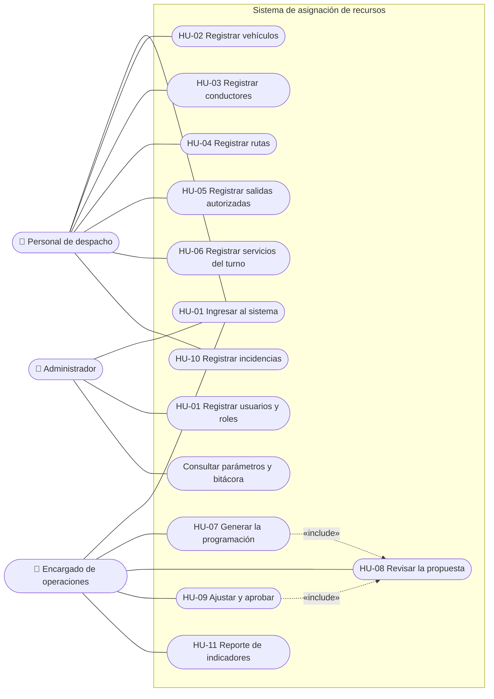

Los módulos de cada actor salen de la matriz `Permisos`
(`paquetes/dominio/lib/src/modelos/usuario.dart`), que comparten el servidor
(autorización de cada solicitud) y el cliente (navegación).

---

## 2. Componentes

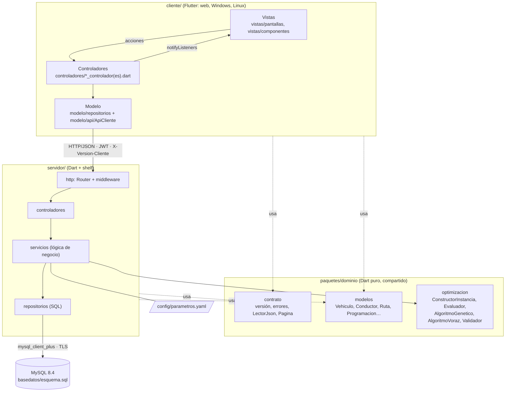

---

## 3. Clases del núcleo (paquete `dominio`)

Patrones: **Strategy** (`EstrategiaOptimizacion`), **Factory**
(`FabricaEstrategias`) y objetos de valor inmutables.

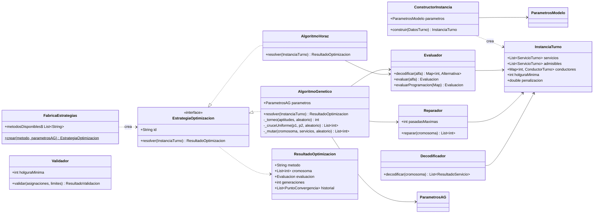

Modelos de datos compartidos (todos con `toJson`/`fromJson` del contrato):

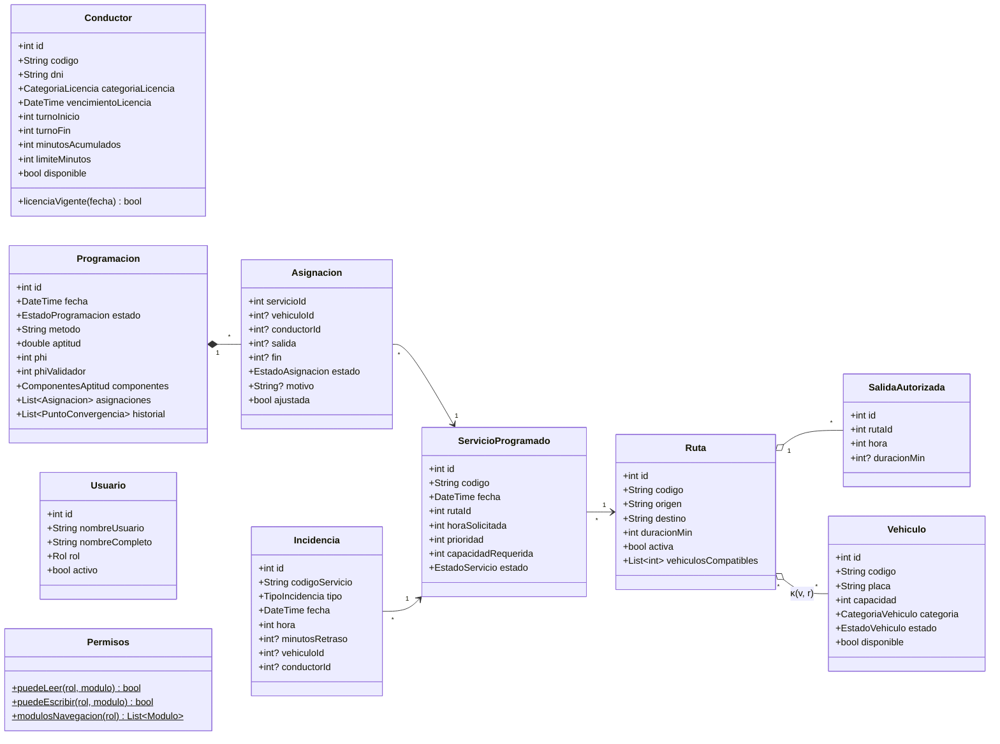

---

## 4. Clases del servidor

Capas **Router → Controlador → Servicio → Repositorio → MySQL**. Los
controladores no tienen SQL ni reglas de negocio; los servicios no conocen
HTTP; solo los repositorios escriben SQL. Patrón **Repository** (interfaz +
implementación MySQL) y **raíz de composición** (`crearAplicacion`).

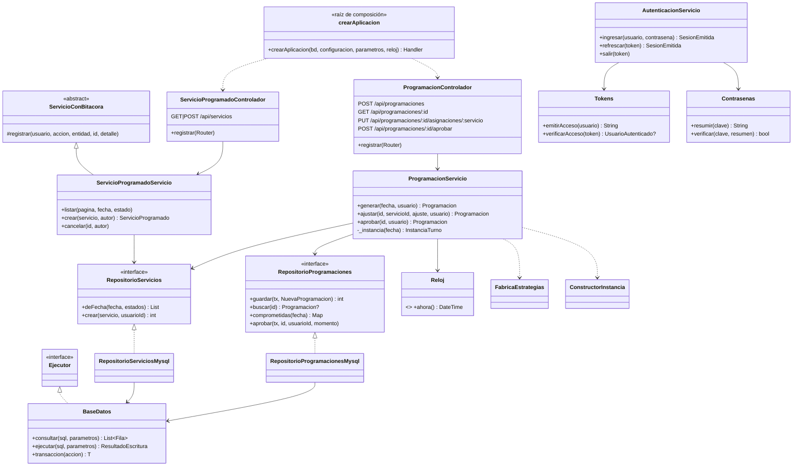

El diagrama muestra en detalle el caso de uso principal; los demás recursos
siguen el mismo patrón (un controlador, un servicio y un repositorio por
recurso):

| Recurso | Controlador | Servicio | Repositorio |
|---|---|---|---|
| Sesión | `AutenticacionControlador` | `AutenticacionServicio` | `RepositorioUsuarios`, `RepositorioSesiones` |
| Usuarios | `UsuarioControlador` | `UsuarioServicio` | `RepositorioUsuarios` |
| Vehículos | `VehiculoControlador` | `VehiculoServicio` | `RepositorioVehiculos` |
| Conductores | `ConductorControlador` | `ConductorServicio` | `RepositorioConductores` |
| Rutas y salidas | `RutaControlador` | `RutaServicio` | `RepositorioRutas` |
| Servicios | `ServicioProgramadoControlador` | `ServicioProgramadoServicio` | `RepositorioServicios` |
| Programación | `ProgramacionControlador` | `ProgramacionServicio` | `RepositorioProgramaciones` (+ los de registros) |
| Incidencias | `IncidenciaControlador` | `IncidenciaServicio` | `RepositorioIncidencias` |
| Reportes, bitácora, parámetros | `ReporteControlador` | `ReporteServicio`, `BitacoraServicio`, `ParametrosServicio` | `RepositorioReportes`, `RepositorioBitacora` |

Middleware, en orden: `cabecerasComunes` → `cors` → `registrarSolicitudes` →
`manejarErrores` → `verificarVersionCliente` → `autenticar` → `Router`.

---

## 5. Clases del cliente (MVC)

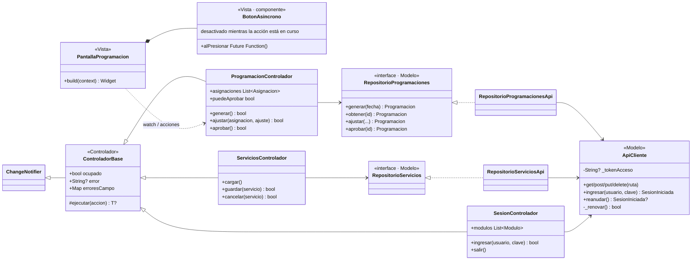

Regla de capas (verificable con `grep`): ningún archivo de
`cliente/lib/controladores/` ni de `cliente/lib/vistas/` importa
`package:http`; solo `cliente/lib/modelo/api/` lo hace.

---

## 6. Secuencia: generar la programación (HU-07)

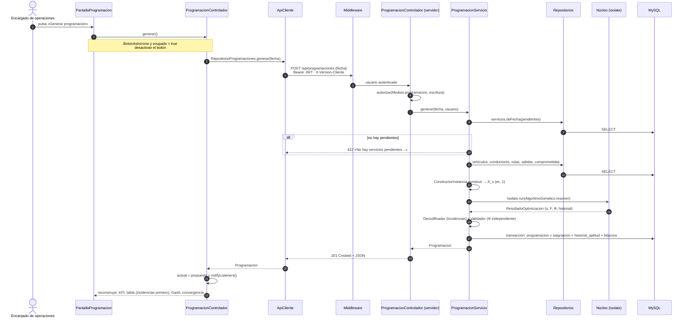

---

## 7. Secuencia: registrar un servicio (HU-06, ciclo completo)

Es el flujo que verifica `cliente/integration_test/ciclo_completo_test.dart`.

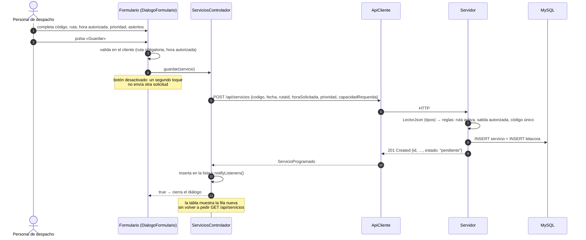

---

## 8. Secuencia: ingreso y renovación de la sesión (HU-01)

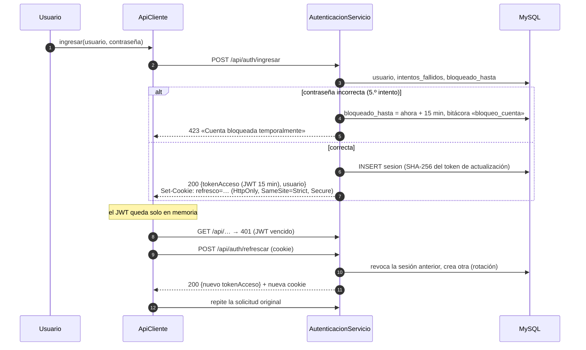

---

## 9. Actividad: flujo operativo (Figura 5 de la tesis)

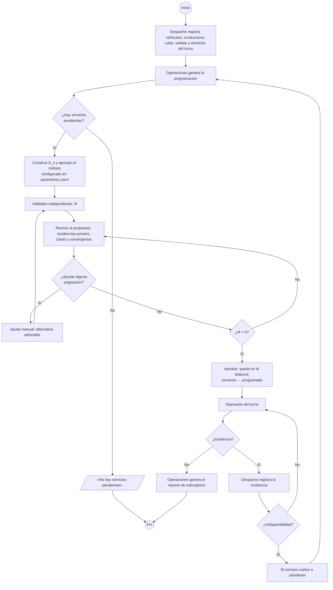

---

## 10. Despliegue

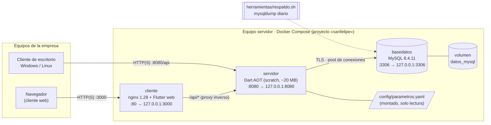

---

## 11. Entidad–relación

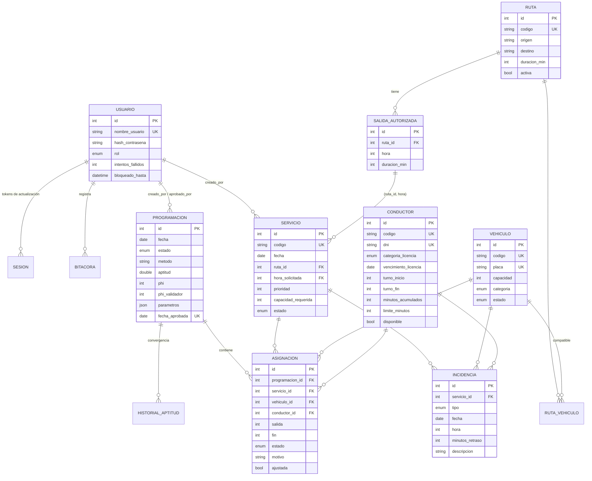

La correspondencia de cada tabla con los conjuntos y parámetros del modelo
está en [`modelo_datos.md`](modelo_datos.md).
